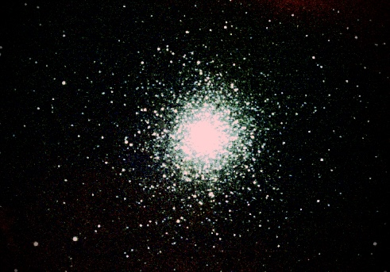
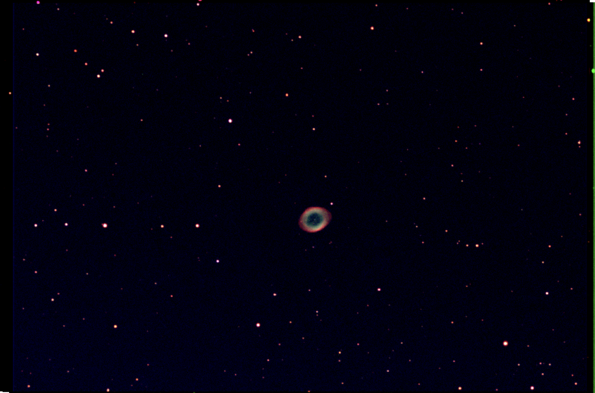
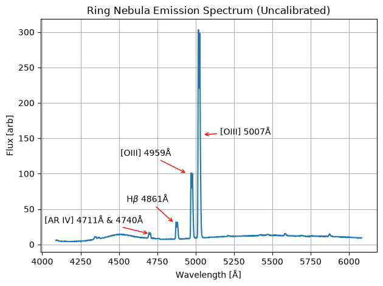

# Mount Stony Brook Observatory

This repository stores some data and reduction notebooks for observations conducted at the Mount Stony Brook Observatory at Stony Brook University. The current analysis notebooks are as follows:

1) The `data/m13/` directory contains flats, darks, raw observations, and reduced/combined data for the B, V, and R data bands for observations of the Hercules Cluster. The subsequent `notebooks/hercules_photometry.ipynb` notebook shows a walkthrough of standard data processing, after which the stacked images in each filter can be used to create a color image in the software of the user's choosing (i.e. `ds9` or `astropy`). RGB Image of the Hercules Cluster created using the data in this repository:

2) The `data/ring_nebula_photometry/` directory contains flats, darks, raw observations, and reduced/combined data for the B, V, and R data bands for observations of the Ring Nebula. The subsequent `notebooks/ring_nebula_photometry.ipynb` notebook shows a walkthrough of standard data processing, after which the stacked images in each filter can be used to create a color image in the software of the user's choosing (i.e. `ds9` or `astropy`). RGB Image of the Ring Nebula created using the data in this repository:

3) The `data/ring_nebula` directory contains flats, darks, arc lamp spectra, Vega calibration spectra, and raw spectroscopic observations for the Ring Nebula. The notebook `ring_nebula_spectroscopy.ipynb` provides a general walkthrough of analyzing the data in the Mercury and Neon arc lamp ranges and identifying some absoprtion lines in Vega and emission lines in the Ring Nebula. Emission spectra (uncalibtrated to the instrument sensitivity) of the Ring Nebula, with various identified emission lines labeled, created using the data in this repository:
